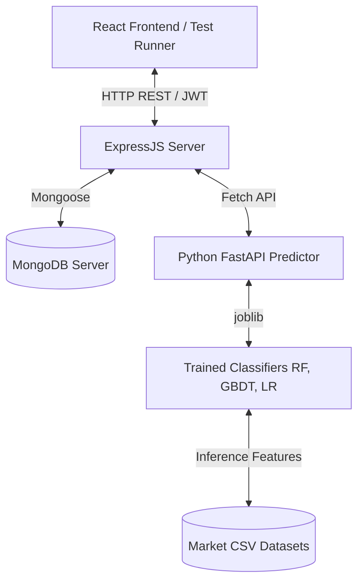

# Paper Pulse - Production Backend Trading Engine

Paper Pulse is a secure, modular, and persistent educational paper-trading simulator. It features real MongoDB-backed user authentication, wallet systems, portfolio tracking, and integration with a time-series Machine Learning price-direction classification pipeline.

---

## 🏗️ Architecture



The backend is built with the **MERN** stack architecture (Node.js/Express, Mongoose/MongoDB, and Python for the prediction engine):
1.  **Express API Gateway**: Acts as the single entrance point for clients. Secures endpoints using JWT authentication, manages manual trading execution, wallet state, and retrieves historical data.
2.  **Mongoose Models**: Persistent models (User, Wallet, Portfolio, Trade) stored securely in MongoDB.
3.  **FastAPI Service**: A lightweight Python microservice exposing trained model prediction endpoints on port `8000`.
4.  **CSV Stock Datasets**: Cleaned historical OHLCV data for NSE stocks (TCS, HDFC, INFOSYS, SBI, TATAPOWER) stored locally inside `data/csv/`.

---

## 📂 Project Directory Structure

```text
Paper_pulse/
├── config/
│   └── db.js                    # MongoDB connection initialization
├── controllers/
│   ├── authController.js        # Authentication endpoints
│   ├── tradeController.js       # Manual & automatic trading execution
│   ├── explanationController.js # Financial term explanations
│   ├── walletController.js      # Wallet balance & resets
│   ├── portfolioController.js   # Portfolio holdings
│   ├── stockController.js       # Stock details & CSV history
│   └── mlController.js          # Python ML prediction broker
├── data/
│   ├── csv/                     # Cleaned stock CSV datasets
│   └── explanationsData.json    # Seed dictionary definitions
├── middleware/
│   ├── authMiddleware.js        # JWT token verification
│   └── errorHandler.js          # Express error handling
├── ml/
│   ├── requirements.txt         # Python dependencies
│   ├── README.md                # ML pipeline docs
│   ├── models/
│   │   └── trained/             # Serialized joblib classifiers & JSON metadata
│   └── scripts/
│       ├── preprocess.py        # Date cleaning & OHLCV validations
│       ├── feature_engineering.py# Tech indicators & autoregressive lags
│       ├── train.py             # Hyperparameter tuning CLI
│       ├── evaluate.py          # Chronological test metrics CLI
│       ├── predict.py           # Day-by-day inference CLI
│       └── backtest.py          # Account equity backtesting CLI
├── models/
│   ├── User.js                  # User profile schema
│   ├── Wallet.js                # Wallet balances schema
│   ├── Portfolio.js             # Unique user-symbol stock holdings
│   ├── Trade.js                 # Unified manual/auto trade history
│   └── Explanation.js           # Dictionary seed schema
├── routes/
│   ├── authRoutes.js            # Auth routes
│   ├── tradeRoutes.js           # Trade routes
│   ├── explanationRoutes.js     # Explanations routes
│   ├── walletRoutes.js          # Wallet routes
│   ├── portfolioRoutes.js       # Portfolio routes
│   ├── stockRoutes.js           # Stock details routes
│   └── mlRoutes.js              # ML prediction endpoints
├── scripts/
│   ├── testFlow.js              # Internal service integration tests
│   └── testE2EHttp.js           # HTTP API endpoint E2E tests
├── services/
│   ├── authService.js           # Auth operations
│   ├── walletService.js         # Real Mongoose wallet manager
│   ├── portfolioService.js      # Real Mongoose portfolio calculator
│   ├── tradingService.js        # Core manual BUY/SELL engine
│   ├── autoTradingService.js    # Automated signal processor
│   ├── tradeHistoryService.js   # Mongoose trade logs
│   ├── csvStockService.js       # CSV file normalizer
│   └── explanationService.js    # Educational seed service
├── utils/
│   ├── apiResponse.js           # Uniform JSON response utilities
│   └── transactionHelper.js     # Standalone-safe Mongoose transactions
├── server.js                    # Server startup script
├── .env.example                 # Environment template
└── README.md                    # Backend documentation
```

---

## ⚙️ Setup & Installation

### 1. Prerequisites
- **Node.js**: v18.0 or newer
- **Python**: v3.12 or newer
- **MongoDB**: Standalone or replica set instance running locally or on MongoDB Atlas

### 2. Node.js Environment Setup
From the `Paper_pulse/` root:
```bash
# Install dependencies
npm install

# Create environment file
cp .env.example .env
```
Update `.env` with your JWT secret, MongoDB connection URI, and other variables.

### 3. Python ML Environment Setup
```bash
# Create virtual environment
python -m venv ml/.venv

# Activate virtual environment
# Windows (PowerShell):
.\ml\.venv\Scripts\Activate.ps1
# macOS/Linux:
source ml/.venv/bin/activate

# Install requirements
pip install -r ml/requirements.txt
```

---

## 🤖 Python ML Pipeline Commands

Before making predictions, ensure you train models for your supported stock symbols:

### 1. Model Training
```bash
# Train a model for TCS
python ml/scripts/train.py --symbol TCS

# Train models for ALL available stock datasets
python ml/scripts/train.py --symbol ALL
```

### 2. Model Evaluation
```bash
# View test metrics and key driver features
python ml/scripts/evaluate.py --symbol TCS
```

### 3. Historical Signal Backtesting
```bash
# Backtest model performance with Rs. 100,000 initial capital
python ml/scripts/backtest.py --symbol TCS
```

### 4. Run the Python FastAPI Prediction Server
```bash
# Start FastAPI on http://127.0.0.1:8000
python ml/api/ml_api.py
```

---

## 🚀 Running the Application

1.  Start the Python ML API service:
    ```bash
    python ml/api/ml_api.py
    ```
2.  Start the Express.js server:
    ```bash
    npm run start
    ```
    *Runs by default on http://localhost:5000*

---

## 📡 API Endpoint Reference

### 1. Authentication

*   `POST /api/auth/register` - Register a new user.
*   `POST /api/auth/login` - Authenticate credentials and get JWT token.
*   `GET /api/auth/me` - Get logged-in user profile.

### 2. Wallet (Requires JWT)

*   `GET /api/wallet` - Retrieve balance.
*   `POST /api/wallet/reset` - Reset balance to ₹100,000.

### 3. Portfolio (Requires JWT)

*   `GET /api/portfolio` - Fetch all stock holdings.
*   `GET /api/portfolio/:symbol` - Fetch holding details for a specific symbol.

### 4. Trading (Requires JWT)

*   `POST /api/trades/execute` - Execute manual BUY/SELL/HOLD trade.
    *   *Body example:*
        ```json
        {
          "symbol": "TCS",
          "action": "BUY",
          "quantity": 10,
          "price": 2270
        }
        ```
*   `POST /api/trades/auto-signal` - Trigger automatic trade driven by the live ML forecast.
    *   *Body example:*
        ```json
        {
          "symbol": "TCS",
          "quantity": 10
        }
        ```
*   `GET /api/trades` - Retrieve historical trades list.

### 5. Stocks (Public Market Data)

*   `GET /api/stocks` - Returns list of supported symbols.
*   `GET /api/stocks/:symbol` - Returns current price.
*   `GET /api/stocks/:symbol/history` - Returns historical records.

### 6. Educational (Public)

*   `GET /api/explanations` - Fetch explanations dictionary.
*   `GET /api/explanations/:term` - Fetch explanation details for a term.

---

## 🧪 Testing Commands

Ensure both your local MongoDB is running and the Python FastAPI server (`python ml/api/ml_api.py`) is active.

### Run Service Unit Tests
Tests the services (Wallet, Portfolio, Trading, History) directly in MongoDB:
```bash
npm run test
# OR: node scripts/testFlow.js
```

### Run HTTP API End-To-End Tests
Tests all endpoints using actual Express HTTP requests and JWT headers:
```bash
node scripts/testE2EHttp.js
```
